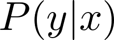
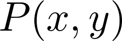
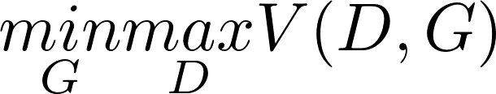
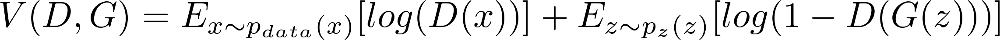
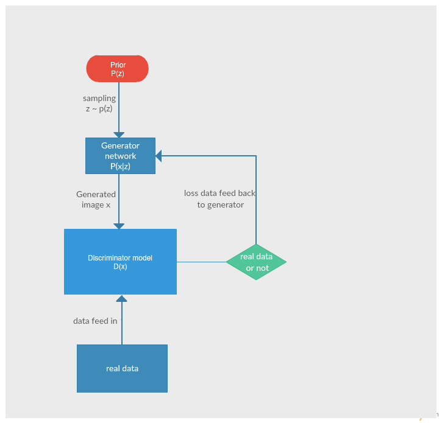
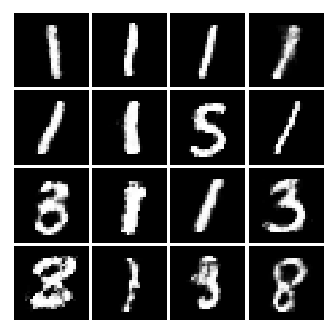
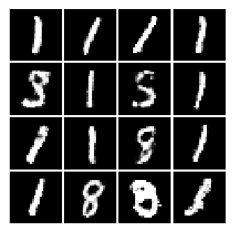
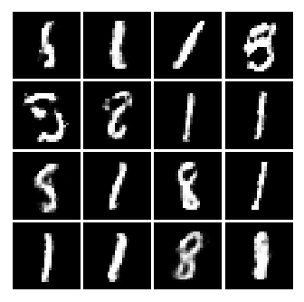
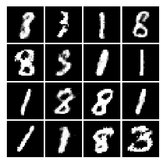

# Project 1

This is a blog on Generative Adversarial Networks (GANs)

Generative Adversarial Networks is an unsupervised learning technique capable of generating realistic synthetic data. In the field of computer vision, one can leverage the practically unlimited amount of unlabeled images and videos to learn good intermediate representations, which can then be used on a variety of supervised learning tasks such as image classification. This algorithm can generate brand new data from training data which is realistic even by human observation.

The rest of this post will describe the GAN algorithm flow in a bit more detail, and provide a brief example (with code in TensorFlow) of using a GAN to solve a toy problem.

# Part 1 -- Background and How They Work

### Discriminative vs. Generative models

Before starting GANs, let’s briefly review the definition about generative and discriminative models:

- Discriminative model: Discriminative models are a class of models used in machine learning for modeling the dependence of an unobserved variable y on an observed variable x. Within a probabilistic framework, this is done by modeling the conditional probability distribution.
<p align="center">
  
</p>

- Generative model: In probability and statistics, a generative model is a model for randomly generating observable data values, typically given some hidden parameters. It specifies a joint probability distribution over observation and label sequences. 
<p align="center">
  
</p>

And generative model can even identify data which it has never seen before.

### Generative Adversarial Networks

The generative adversarial networks algorithm was first introduced by Ian Goodfellow et al. in 2014. 
This algorithm simultaneously trains two competing neural networks models: a generative model G that captures the data distribution, and a discriminative model D that estimates the probability that a sample came from the training data rather than G. The training procedure for G is to maximize the probability of D making a mistake. This framework corresponds to a minimax two-player game. The details expression mathematically are showed below:

<p align="center">
  
</p>

<p align="center">
  
</p>

The workflow is showed below:

<p align="center">
  
</p>

This new algorithm comes with advantages and disadvantages. The disadvantages are primarily that there is no stable representation of generated data, and that D must be synchronized well with G during training. Otherwise one of the neural networks will dominate the whole training process and the output will be quite random and not reliable. The advantages are there are barely any prerequist for this unsupervised learning, only backprop is used to obtain gradients, no inference is needed during learning, and a wide variety of functions can be incorporated into the model. You can adjust the optimizer function, loss function, detailed neural models and so on. This kind of flexibility makes this algorithm work in many cases. 

# Part 2 -- Application
## Generate MNIST dataset data

### Create model for GANs

First, usually a 2-layer neural network is enough to handle basic problem. So I use 2-layer neural networks for both generator and discriminator. The relu activation function is to add some non-linear classification to gain better performance since this is not a simple linear problem.

```python
def generator(Z):
    G_layer1 = tf.nn.relu(tf.matmul(Z, G_W1) + G_b1)
    G_layer2 = tf.matmul(G_layer1, G_W2) + G_b2
    G_prob = tf.nn.sigmoid(G_layer2)

    return G_prob

# output result of neural networks before and after sigmoid function
def discriminator(X):
    D_layer1 = tf.nn.relu(tf.matmul(X, D_W1) + D_b1)
    D_layer2 = tf.matmul(D_layer1, D_W2) + D_b2
    D_prob = tf.nn.sigmoid(D_layer2)

    return D_prob, D_layer2
```

The code below is to calculate loss function based on equation below: D-loss and G-loss.

```python
# discriminator output
D_real, D_logit_real = discriminator(X)
D_fake, D_logit_fake = discriminator(generator(Z))

# Generator loss:
D_loss_real = tf.reduce_mean(
    tf.nn.sigmoid_cross_entropy_with_logits(logits=D_logit_real, labels=tf.ones_like(D_logit_real)))
D_loss_fake = tf.reduce_mean(
    tf.nn.sigmoid_cross_entropy_with_logits(logits=D_logit_fake, labels=tf.zeros_like(D_logit_fake)))
D_loss = D_loss_real + D_loss_fake
# the loss of generator: regard the fake list's 1 as success
G_loss = tf.reduce_mean(
    tf.nn.sigmoid_cross_entropy_with_logits(logits=D_logit_fake, labels=tf.ones_like(D_logit_fake)))
```

Then we need these loss function to do min-max game for both discriminator and generator. I use gradient descent optimizer, the learning_rate should be adjusted accrording to results. Of course, feel free to try other optimizer.

```python
# optimize the parameters list: thera_D by minimize D_loss
D_solver = tf.train.GradientDescentOptimizer(learning_rate=0.5).minimize(D_loss, var_list=para_D)
G_solver = tf.train.GradientDescentOptimizer(learning_rate=0.5).minimize(G_loss, var_list=para_G)
```

After we finished building the model, we start to do the train section. We use tensorflow session to de training. sess.run function is using the feed_dict as input and run the equation in [] part and return their results. because the only thing we need to train is the parameter of Generator and discriminator networks. So equation we only need to call are D_solver and G_solver.

```python
# initialize the tensorflow session
sess = tf.Session()
sess.run(tf.global_variables_initializer())


for it in range(iters):
    # get real data from mnist
    X_mb, _ = mnist.train.next_batch(realdata_size)

    # run the generator and discriminator, input data X with X_mb and Z with sample_z;
    _, D_loss_curr = sess.run([D_solver, D_loss], feed_dict={X: X_mb, Z: sample_Z(realdata_size, layer2_dimension)})
    _, G_loss_curr = sess.run([G_solver, G_loss], feed_dict={Z: sample_Z(realdata_size, layer2_dimension)})

    if it % print_steps == 0:
        print('Iter: {}'.format(it), ' D loss: {:.4}'.format(D_loss_curr), ' G_loss: {:.4}'.format(G_loss_curr))
        # plot the figure at the same time to check output
```

Here showes some results from generator:

<p align="center">
  
  
  
</p>

# Conlusion

Every print_steps times, I would output the first 16 samples get from generator to check its correctness by my obeservation. And I found this results are fairly unstable. Each time the number it tried to generate is totally different. However, its performance really improved quite a lot comparing that at the begining and at the end of training. You can see generated MNIST looked quite meaningful in last image. And according to the paper, the generator will not memory the training set, so this is a practical algorithm for rendering virtural images.

And in the experiment, the training process will take a long time to get good performance. For gradient optimizer, it takes 998 seconds to run 50000 iterations. And the outcome is still not satisfied enough as you can see in my jupyter notebook. And if I run the process for 1 million iterations. The result is pretty good, as showed below: 

<p align="center">
  
</p>

# Reference
- http://blog.aylien.com/introduction-generative-adversarial-networks-code-tensorflow/
- https://arxiv.org/abs/1701.00160
- https://en.wikipedia.org/wiki/Generative_model
- https://en.wikipedia.org/wiki/Discriminative_model
