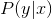

# Homework

This is a blog on Generative Adversarial Networks (GANs)

Generative Adversarial Networks is an unsupervised learning technique capable of generating realistic synthetic data. In the field of computer vision, one can leverage the practically unlimited amount of unlabeled images and videos to learn good intermediate representations, which can then be used on a variety of supervised learning tasks such as image classification. This algorithm can generate brand new data from training data which is realistic even by human observation.

The rest of this post will describe the GAN algorithm flow in a bit more detail, and provide a brief example (with code in TensorFlow) of using a GAN to solve a toy problem.

# Part 1 -- Background and How They Work

### Discriminative vs. Generative models

Before starting GANs, let’s briefly review the definition about generative and discriminative models:

- Discriminative model: Discriminative models are a class of models used in machine learning for modeling the dependence of an unobserved variable y on an observed variable x. Within a probabilistic framework, this is done by modeling the conditional probability distribution ![f1] .

- Generative model: In probability and statistics, a generative model is a model for randomly generating observable data values, typically given some hidden parameters. It specifies a joint probability distribution over observation and label sequences. ![f2]

And generative model can even identify data which it has never seen before.

### Generative Adversarial Networks

The generative adversarial networks algorithm was first introduced by Ian Goodfellow et al. in 2014. 
This algorithm implemented by two competing neural networks models.

  

# Part 2 -- Application
### Generate MNIST dataset data

D_loss_real = tf.reduce_mean(tf.nn.sigmoid_cross_entropy_with_logits(logits=D_logit_real, labels=tf.ones_like(D_logit_real)))
D_loss_fake = tf.reduce_mean(tf.nn.sigmoid_cross_entropy_with_logits(logits=D_logit_fake, labels=tf.zeros_like(D_logit_fake)))
D_loss = D_loss_real + D_loss_fake
the loss of generator: regard the fake list's 1 as success
G_loss = tf.reduce_mean(tf.nn.sigmoid_cross_entropy_with_logits(logits=D_logit_fake, labels=tf.ones_like(D_logit_fake)))

// optimize the parameters list: thera_D by minimize D_loss
D_solver = tf.train.AdamOptimizer().minimize(D_loss, var_list=theta_D)
G_solver = tf.train.AdamOptimizer().minimize(G_loss, var_list=theta_G)

// run the generator and discriminator, input data X with X_mb and Z with sample_z;
 _, D_loss_curr = sess.run([D_solver, D_loss], feed_dict={X: X_mb, Z: sample_Z(mb_size, Z_dim)})
_, G_loss_curr = sess.run([G_solver, G_loss], feed_dict={Z: sample_Z(mb_size, Z_dim)})

// retreive first 16 images from generated data to plot
samples = sess.run(G_sample, feed_dict={Z: sample_Z(16, Z_dim)})

[f1]:http://chart.apis.google.com/chart?cht=tx&chl=P(y|x)
[f2]:http://chart.apis.google.com/chart?cht=tx&chl=P(x,y)
[f3]:http://chart.apis.google.com/chart?cht=tx&chl=\underset{(s,t)\inS_{xy}}
